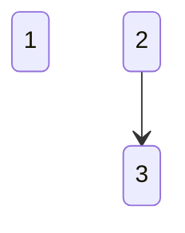
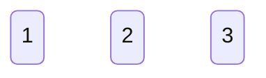
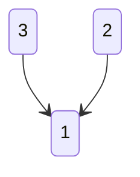
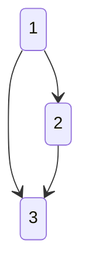

$u_{k}=\begin{cases}42\text{ si }k=0 \\ 1022 \times u_{k-1}\text{ mod }1048573\text{ si }k>0\end{cases}$

Question 2
Si $n=1$ évident :
Il n'a qu'une seule feuille

Sinon, comme $i$ peut valoir au plus $n-1$ (dans le cas où $u_{k}\equiv n-2[n-1]$)
On a deux sous-arbres avec $n$ strictement décroissant, donc au plus $n$ feuilles
Par H.R. ...

Q5

<u>Nombre de composantes connexes</u>
Si $a=\texttt{true}$ alors il n'y a qu'une seule composante connexe
Sinon, $\texttt{CC}(T)=\texttt{CC}(T_{d})+\texttt{CC}(T_{g})$

<u>Nombre d'arrêtes</u>
Si $a=\texttt{true}$
Alors 

<u>Degré le plus élevé</u>
si $a=\texttt{true}$
Alors $\mathrm{deg}(T)=$ nb feuilles - 1
sinon $\mathrm{deg}(T)=\max(\mathrm{deg}(T_{d}),\mathrm{deg}(T_{g}))$

