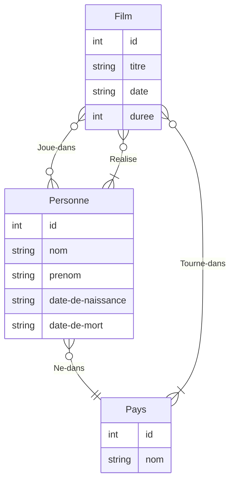
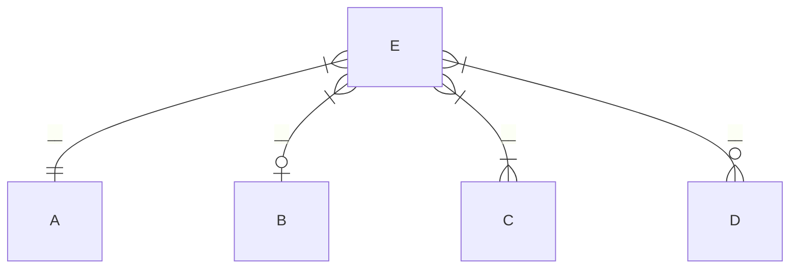

# I - Modèle entité-association, modèle relationnel
Un schéma entité-associations représente des ensembles d'entités qui sont caractérisées pas des attributs, et des associations possibles entre les entités de ces ensembles

Les associations sont munies de cardinalités pour les deux ensembles d'entité. Dans le cas de l'association $f$ entre $A$ et $B$, on a les cardinalités suivantes du côté de $B$

à chaque entité de E est associée:
- une entité de A
- zéro ou une entité de B
- au moins une entité de C
- zéro ou plus entités de D

Définition:
> On appelle table ou relation d'arité $n$ un ensemble de $n$-uplets
> Un attribut d'une relation $R$ indique un terme des $n$-uplets de $R$
> Chaque attribut a un nom et un domaine
> Chaque colonne de $R$ est sa projection sur un de ses attributs
> Une ligne de $R$ est un élément de $R$

Définition:
> Une clé primaire d'une relation $R$ est un sous-ensemble des attributs de $R$ tel que la projection de $R$ sur ces attributs soit injective
> Il est souhaitable qu'on ait aucune raison de modifier les valeurs des lignes de $R$ pour ces attributs

Définition:
> Soient $R,R'$ deux relations
> Une clé étrangère de $R$ référençant $R'$ est un attribut de $R$ dont les valeurs sont dans l'ensemble des valeurs de la clé primaire de $R'$
> En pratique, une clé étrangère définit une fonction $f:R\to R'$

Définition:
> Une base de données relationnelle est un ensemble de relations toutes munies d'une clé primaire et la donnée des clés étrangères de ces relations
> La donnée des attributs, clés primaires, et clés étrangères constitue le schéma relationnel

Pour passer d'un schéma Entité-association à un schéma relationnel, on procède ainsi:
- A chaque ensemble d'entité correspond une relation. Ses attributs incluent les attributs de l'entité
- Si on a une association `A }|-` ou `A}|-`  `-|| B` ou `-o| B` `: f`, alors on représente $f$ par une clé étrangère de $R_{A}$ référençant $R_{B}$
- Si on a une association `A }|-` ou `A}|-`  `-|{ B` ou `-o{ B` `: f`, alors on représente $f$ par une relation avec une clé étrangère $\mathrm{id}_{A}$ référençant $R_{A}$ et une clé étrangère $\mathrm{id}_{B}$ référençant $R_{B}$. La clé primaire de $R_{f}$ est $(\mathrm{id}_{A},\mathrm{id}_{B})$

# II - Requêtes SQL

Une requête SQL consiste à calculer une relation dérivée à partir des relations de base de la BDD, c'est à dire, une relation définie à partir des relations de base par une formule logique
- Si $R$ est une relation (de base ou dérivée) qui a les attributs (entre autres) $a_{1},\dots,a_{k}$, $\texttt{SELECT } a_{1},\dots,a_{k}\texttt{ FROM }R$ calcule la relation projetée sur $a_{1},\dots,a_{k}$ On peut utiliser `*` pour désigner toutes les colonnes d'une relation
- Si $R$ est une relation dont $a$ est un attribut, et que $P$ est un prédicat sur le domaine de $a$, alors $\texttt{SELECT * FROM } R \texttt{ WHERE }P(a)$ calcule la relation $\{ x\in R|P(x.a) \}$
- $R_{1}\times R_{2}$ est le produit cartésien des relations $R_{1}$ et $R_{2}$ dont les attributs sont $R_{1}\text{.(attribut de }R_{1})$ ou $R_{1}\text{.(attribut de }R_{2})$
  En pratique, seules les lignes d'un produit cartésien où une valeur d'une clé étrangère correspond à la même valeur pour la clé primaire/pour une autre clé étrangère nous intéressent.
  Si $R_{1}\text{.id}R_{2}$ est une clé étrangère qui référence la clé primaire $R_{2}.\mathrm{id}$, $\texttt{SELECT * FROM }R_{1}\texttt{ JOIN }R_{2}\texttt{ ON }R_{1}\text{.id}R_{2}=R_{2}\text{.id}$ calcule la relation $\{ (x,y)\in R_{1}\times R_{2}|x\text{.id}R_{2}=y\text{.id} \}$